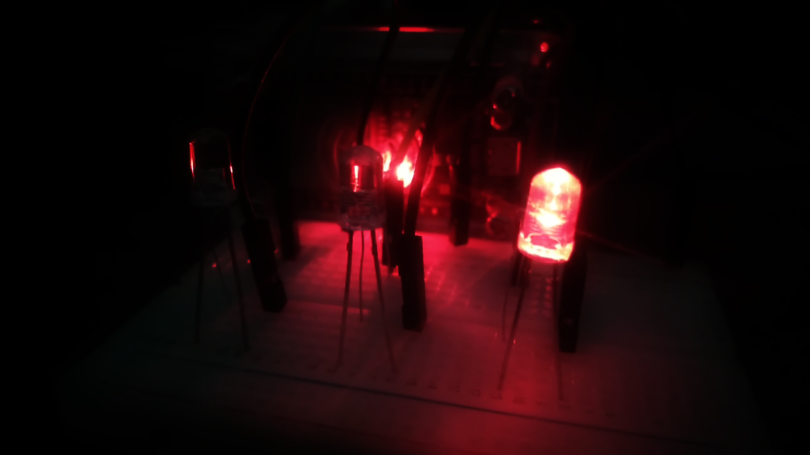
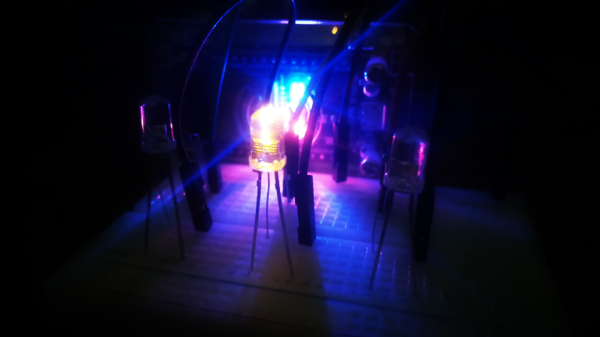
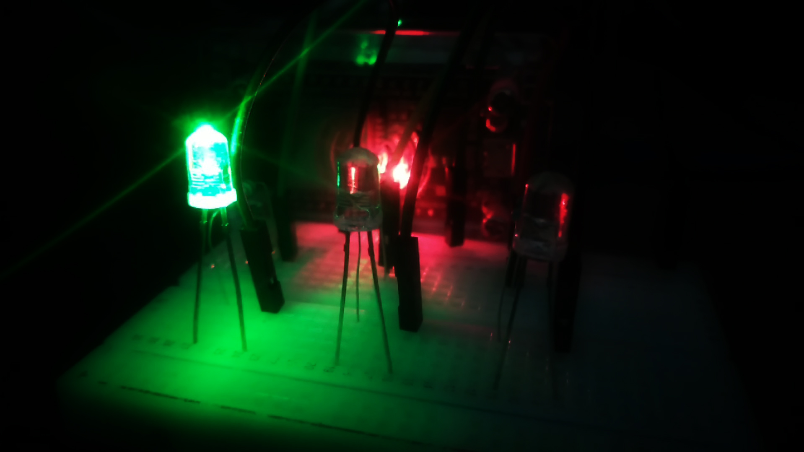

[](https://github.com/ellerbrock/open-source-badges/)
[](https://opensource.org/licenses/MIT)


# ESP32-Based-Traffic-Light-With-LED
Lampu lalu lintas adalah lampu yang mengendalikan arus lalu lintas. Proyek ini dibuat pada dasarnya untuk menunjukkan cara kerja dari sistem lampu lalu lintas. Merah sebagai penanda bahwa pengendara harus berhenti, kuning sebagai penanda bahwa pengendara harus bersiap, dan hijau sebagai penanda bahwa pengendara diperbolehkan berjalan. Proyek ini telah dilaksanakan dan memakan waktu kurang lebih 1 hari. Manfaat dari pembuatan proyek ini tidak lain adalah untuk menambah wawasan. Hasil dari penelitian ini menunjukkan bahwa prototipe lampu lalu lintas dapat berfungsi dengan baik.

<br><br>

## Kebutuhan Proyek
| Bagian | Deskripsi |
| --- | --- |
| Papan Pengembangan | DOIT ESP32 DEVKIT V1 |
| Editor Kode | Arduino IDE |
| Driver | CP210X USB Driver |
| Bahasa Pemrograman | C/C++ |
| Aktuator | • LED Merah (x1)<br>• LED Kuning (x1)<br>• LED Hijau (x1) |
| Komponen Lainnya | • Kabel USB Mikro - USB tipe A (x1)<br>• Kabel jumper (1 set)<br>• Breadboard (x1)<br>• Resistor (x3) |

<br><br>

## Unduh & Instal
1. Arduino IDE

   <table><tr><td width="810">
         
   ```
   https://bit.ly/ArduinoIDE_Installer
   ```

   </td></tr></table><br>
   
2. CP210X USB Driver

   <table><tr><td width="810">
   
   ```
   https://bit.ly/CP210X_USB_Driver
   ```

   </td></tr></table>
   
<br><br>

## Rancangan Proyek
<table>
<tr>
<th width="840">Diagram Ilustrasi</th>
</tr>
<tr>
<td></td>
</tr>
</table>

<br><br>

## Pengaturan Arduino IDE
1. Buka ``` Arduino IDE ``` terlebih dahulu, kemudian buka proyek dengan cara klik ``` File ``` -> ``` Open ``` :

   <table><tr><td width="810">
   
      ``` TrafficLight_Devan.ino ```

   </td></tr></table><br>
   
2. Isi ``` Url Pengelola Papan Tambahan ``` di Arduino IDE

   <table><tr><td width="810">
      
      Klik ``` File ``` -> ``` Preferences ``` -> masukkan ``` Boards Manager Url ``` dengan menyalin tautan berikut :
   
      ```
      https://dl.espressif.com/dl/package_esp32_index.json
      ```

   </td></tr></table><br>
   
3. ``` Pengaturan Board ``` di Arduino IDE
   <table>
      <tr><th width="810">
            
      Cara mengatur board ``` DOIT ESP32 DEVKIT V1 ```
   
      </th></tr>
      <tr><td colspan="2">

      • Klik bagian ``` Tools ``` -> ``` Board ``` -> ``` Boards Manager ``` -> Instal ``` esp32 ```.
      
      • Kemudian klik: ``` Tools ``` -> ``` Board ``` -> ``` ESP32 Arduino ``` -> ``` DOIT ESP32 DEVKIT V1 ```.
              
      </td></tr>
   </table><br>
   
4. ``` Ubah Kecepatan Papan ``` di Arduino IDE

   <table><tr><td width="810">
         
      Klik ``` Tools ``` -> ``` Upload Speed ``` -> ``` 115200 ```

   </td></tr></table><br>
   
5. ``` Pengaturan Port ``` di Arduino IDE

   <table><tr><td width="810">
         
      Klik ``` Port ``` -> Pilih sesuai dengan port perangkat anda ``` (anda dapat melihatnya di Device Manager) ```

   </td></tr></table><br>

6. Sebelum mengunggah program, silakan klik: ``` Verify ```.<br><br>

7. Jika tidak ada kesalahan dalam kode program, silakan klik: ``` Upload ```.<br><br>

8. Jika masih ada masalah saat unggah program, maka coba periksa pada bagian ``` driver ``` / ``` port ``` / ``` yang lainnya ```.

<br><br>

## Memulai
1. Unduh dan ekstrak repositori ini.<br><br>

2. Pastikan anda memiliki komponen elektronik yang diperlukan.<br><br>
   
3. Pastikan komponen anda telah dirancang sesuai dengan diagram.<br><br>
   
4. Konfigurasikan perangkat anda menurut pengaturan di atas.<br><br>
    
5. Selamat menikmati [Selesai].

<br><br>

## Sorotan
<table>
<tr>
<th width="840" colspan="3">Tampilan Lampu Lalu Lintas</th>
</tr>
<tr>
<td width="280"></td>
<td width="280"></td>
<td width="280"></td>
</tr>
</table>

<br><br>

## Apresiasi
Jika karya ini bermanfaat bagi anda, maka dukunglah karya ini sebagai bentuk apresiasi kepada penulis dengan mengklik tombol ``` ⭐Bintang ``` di bagian atas repositori.

<br><br>

## Penafian
Aplikasi ini merupakan hasil karya saya sendiri dan bukan merupakan hasil plagiat dari penelitian atau karya orang lain.

<br><br>

## LISENSI
LISENSI MIT - Hak Cipta © 2024 - Devan C. M. Wijaya, S.Kom

Dengan ini diberikan izin tanpa biaya kepada siapa pun yang mendapatkan salinan perangkat lunak ini dan file dokumentasi terkait perangkat lunak untuk menggunakannya tanpa batasan, termasuk namun tidak terbatas pada hak untuk menggunakan, menyalin, memodifikasi, menggabungkan, mempublikasikan, mendistribusikan, mensublisensikan, dan/atau menjual salinan Perangkat Lunak ini, dan mengizinkan orang yang menerima Perangkat Lunak ini untuk dilengkapi dengan persyaratan berikut:

Pemberitahuan hak cipta di atas dan pemberitahuan izin ini harus menyertai semua salinan atau bagian penting dari Perangkat Lunak.

DALAM HAL APAPUN, PENULIS ATAU PEMEGANG HAK CIPTA DI SINI TETAP MEMILIKI HAK KEPEMILIKAN PENUH. PERANGKAT LUNAK INI DISEDIAKAN SEBAGAIMANA ADANYA, TANPA JAMINAN APAPUN, BAIK TERSURAT MAUPUN TERSIRAT, OLEH KARENA ITU JIKA TERJADI KERUSAKAN, KEHILANGAN, ATAU LAINNYA YANG TIMBUL DARI PENGGUNAAN ATAU URUSAN LAIN DALAM PERANGKAT LUNAK INI, PENULIS ATAU PEMEGANG HAK CIPTA TIDAK BERTANGGUNG JAWAB, KARENA PENGGUNAAN PERANGKAT LUNAK INI TIDAK DIPAKSAKAN SAMA SEKALI, SEHINGGA RISIKO ADALAH MILIK ANDA SENDIRI.
